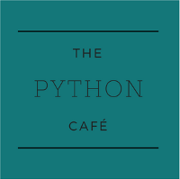
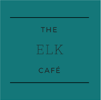
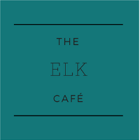

---
#
# Here you can change the text shown in the Home page before the Latest Posts section.
#
# Edit cayman-blog's home layout in _layouts instead if you wanna make some changes
# See: https://jekyllrb.com/docs/themes/#overriding-theme-defaults
#
layout: home
---

Cayman Blog Theme is a clean, responsive blogging theme for Jekyll, with social features. It is inspired by the Cayman Theme for Github Pages, which can be greatly used for single projects but not as blogging platform.

  <b>Some Links:</b> 
  <d href="#"></d>  
  <d href="#"></d> 
  <d href="#"></d>
    

  <b>Some Links:</b> 
    
   
  <a href="#">Link 3</a>
    

You find this descriptive text in the `index.md` file, so you can change it, or remove it completely, according to your needs.
